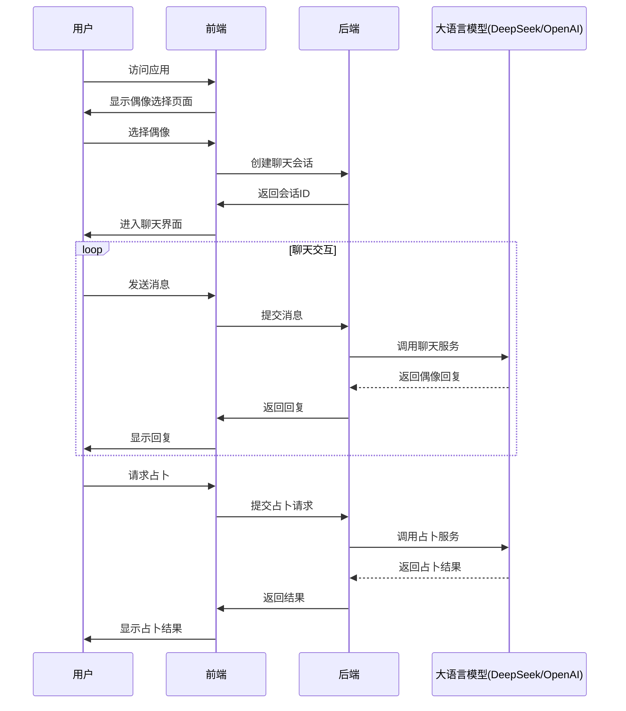
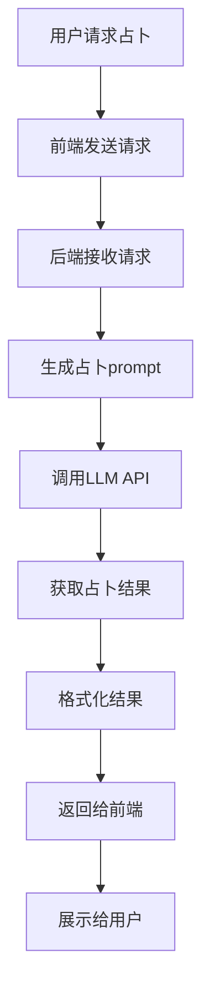
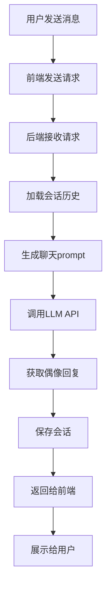
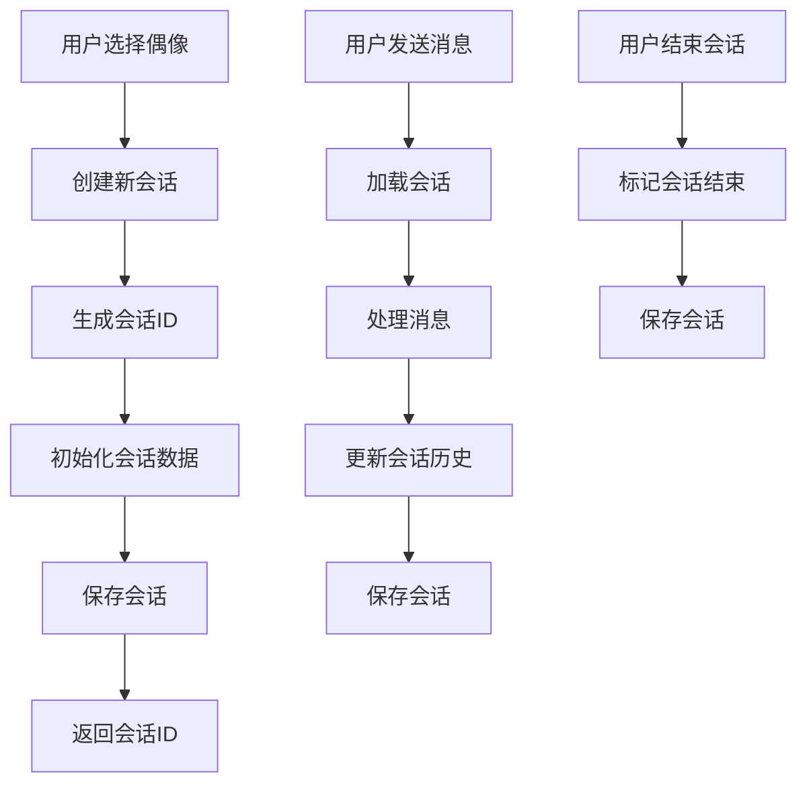
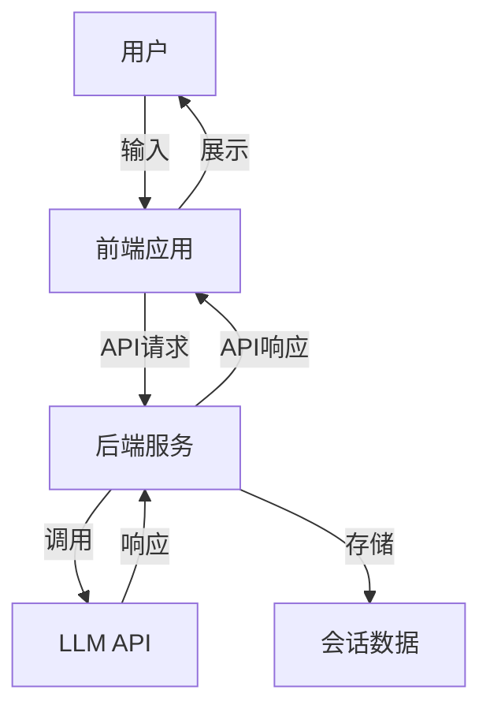
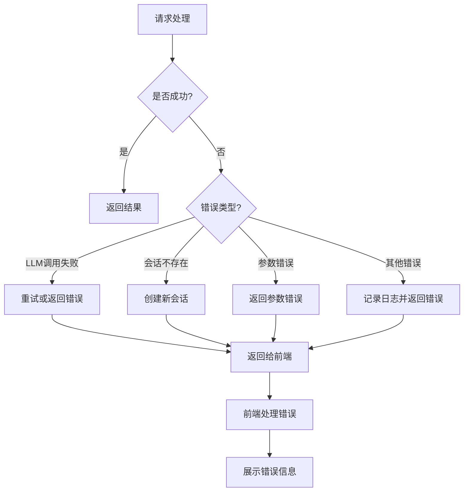

# 聊天占卜偶像流程图

## 系统整体流程

```mermaid
sequenceDiagram
    participant User as 用户
    participant Frontend as 前端
    participant Backend as 后端
    participant LLM as 大语言模型(DeepSeek/OpenAI)

    User->>Frontend: 访问应用
    Frontend->>User: 显示偶像选择页面
    User->>Frontend: 选择偶像
    Frontend->>Backend: 创建聊天会话
    Backend->>Frontend: 返回会话ID
    Frontend->>User: 进入聊天界面

    loop 聊天交互
        User->>Frontend: 发送消息
        Frontend->>Backend: 提交消息
        Backend->>LLM: 调用聊天服务
        LLM-->>Backend: 返回偶像回复
        Backend->>Frontend: 返回回复
        Frontend->>User: 显示回复
    end

    User->>Frontend: 请求占卜
    Frontend->>Backend: 提交占卜请求
    Backend->>LLM: 调用占卜服务
    LLM-->>Backend: 返回占卜结果
    Backend->>Frontend: 返回结果
    Frontend->>User: 显示占卜结果
```

## 占卜服务流程

```mermaid
flowchart TD
    A[用户请求占卜] --> B[前端发送请求]
    B --> C[后端接收请求]
    C --> D[生成占卜prompt]
    D --> E[调用LLM API]
    E --> F[获取占卜结果]
    F --> G[格式化结果]
    G --> H[返回给前端]
    H --> I[展示给用户]
```

## 偶像聊天流程

```mermaid
flowchart TD
    A[用户发送消息] --> B[前端发送请求]
    B --> C[后端接收请求]
    C --> D[加载会话历史]
    D --> E[生成聊天prompt]
    E --> F[调用LLM API]
    F --> G[获取偶像回复]
    G --> H[保存会话]
    H --> I[返回给前端]
    I --> J[展示给用户]
```

## 会话管理流程

```mermaid
flowchart TD
    A[用户选择偶像] --> B[创建新会话]
    B --> C[生成会话ID]
    C --> D[初始化会话数据]
    D --> E[保存会话]
    E --> F[返回会话ID]
    
    G[用户发送消息] --> H[加载会话]
    H --> I[处理消息]
    I --> J[更新会话历史]
    J --> K[保存会话]
    
    L[用户结束会话] --> M[标记会话结束]
    M --> N[保存会话]
```

## 数据流向

```mermaid
flowchart TD
    A[用户] -->|输入| B[前端应用]
    B -->|API请求| C[后端服务]
    C -->|调用| D[LLM API]
    D -->|响应| C
    C -->|存储| E[会话数据]
    C -->|API响应| B
    B -->|展示| A
```

## 错误处理流程

```mermaid
flowchart TD
    A[请求处理] --> B{是否成功?}
    B -->|是| C[返回结果]
    B -->|否| D{错误类型?}
    D -->|LLM调用失败| E[重试或返回错误]
    D -->|会话不存在| F[创建新会话]
    D -->|参数错误| G[返回参数错误]
    D -->|其他错误| H[记录日志并返回错误]
    E --> I[返回给前端]
    F --> I
    G --> I
    H --> I
    I --> J[前端处理错误]
    J --> K[展示错误信息]
```